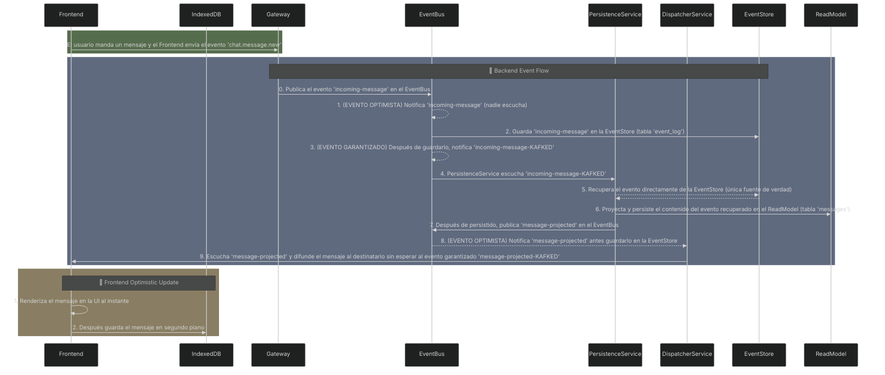

# Kafky-Event-Driven Chat

Este proyecto es una aplicación de chat construida con Node.js para demostrar una **Arquitectura Orientada a Eventos (EDA)** en un entorno simulado de microservicios. Implementa patrones como **Event Sourcing** y **CQRS** demostrando la interacción desacoplada de microservicios.

> 📘 **This document is also available in English:**  
> [Read in English](README-es.md)

## Objetivo del Proyecto

El propósito es servir como un ejemplo práctico y didáctico para entender conceptos clave de arquitecturas modernas:

*   ✅ **Event Bus Centralizado**: Un intermediario que desacopla los componentes del sistema.
*   ✅ **Event Sourcing**: Cada acción de negocio se captura como un evento inmutable en un **Event Store**. Esta es la única fuente de la verdad del sistema.
*   ✅ **CQRS**: Lógica de escritura (comandos que generan eventos) separada de la de lectura (consultas a modelos proyectados).
*   ✅ **Proyecciones**: Un servicio (`PersistenceService`) consume eventos del Event Store para construir un modelo de datos optimizado para consultas.
*   ✅ **Frontend Inteligente**: Utiliza `IndexedDB` para carga instantánea de historiales y `BroadcastChannel` para sincronizar la sesión de chat entre múltiples pestañas del navegador.
*   ✅ **Filosofía Optimista**: Tanto el backend como el frontend priorizan la velocidad de respuesta para mejorar la experiencia de usuario.
  
## TO-DOs
*   **Manejo de errores** con el patrón Sagas.
*   **Validación de esquemas de eventos** con `Ajv`.
*   **Centralizar el logging** en un servicio dedicado.

## Arquitectura de un Vistazo

El flujo de un mensaje, desde que se envía hasta que se recibe, sigue este camino, mostrando la interacción entre los componentes y las capas de persistencia.


*Nota : EventBus intercepta los eventos publicados y SIEMPRE notifica con **Double-Emit**: 

**Eager Emit** : Cuando el evento es publicado (EVENTO OPTIMISTA)

**Kafked Emit** : Después de que el evento ha sido guardado en la EventStore (EVENTO GARANTIZADO)

### ✨ Estrategia de Suscripción: Velocidad vs. Fiabilidad

No todos los servicios necesitan el mismo nivel de garantía. Esta aplicación utiliza diferentes estrategias para optimizar el rendimiento y la consistencia:

| Servicio               | Evento al que se suscribe   | Estrategia      | ¿Por qué?                                                                                                                                              |
| :--------------------- | :-------------------------- | :-------------- | :----------------------------------------------------------------------------------------------------------------------------------------------------- |
| `PersistenceService`   | `incoming-message-KAFKED`   | **Garantizada** | Su trabajo es construir el modelo de lectura. **NO puede** actuar sobre un evento que no esté 100% confirmado en el **Event Store**.                     |
| `DispatcherService`    | `message-projected`         | **Optimista (Eager)** | Escucha `message-projected` directamente. Prioriza la **velocidad** para mejorar la UX y lo hace con seguridad, ya que este evento solo se emite **después** de que la persistencia garantizada haya terminado. |

#### La misma filosofía en el Frontend
El `Frontend` (`main.js`) sigue este mismo principio: cuando recibe un nuevo mensaje, **primero lo renderiza en la pantalla** y **luego intenta guardarlo en `IndexedDB` en segundo plano**. La prioridad es la fluidez de la conversación.

## Componentes Principales

| Archivo              | Rol                         | Responsabilidad Clave                                                                        |
| :------------------- | :-------------------------- | :------------------------------------------------------------------------------------------- |
| `server.js`          | **Gateway**                 | Punto de entrada. Traduce peticiones WebSocket a eventos del dominio.                        |
| `event-bus.js`       | **Event Bus**               | Notifica automáticamente los eventos publicados, después los persiste en el Event Store y ofrece la emisión garantizada.        |
| `persistence-service.js` | **Proyector**               | Escucha eventos **garantizados** para construir y actualizar el modelo de lectura.             |
| `dispatcher.js`      | **Dispatcher**              | Escucha eventos **optimistas** para notificar a los clientes con la mínima latencia.           |
| `database.js`        | **Capa de Datos (Backend)** | Abstracción simplificada para interactuar con la base de datos (que alberga el Event Store y el ReadModel).              |
| `public/main.js`     | **Frontend**                | Gestiona la UI, la persistencia local con `IndexedDB` y la sincronización entre pestañas con `BroadcastChannel`. |

## Cómo Ejecutar el Proyecto

1.  **Instalar dependencias**:
    ```bash
    npm install
    ```

2.  **Configurar la base de datos**:
    ```bash
    node setup-db.js
    ```

3.  **Iniciar el servidor**:
    ```bash
    node server.js
    ```

4.  **Abrir la aplicación**:
    Abre dos navegadores en `http://localhost:8000` y chatea entre dos usuarios.